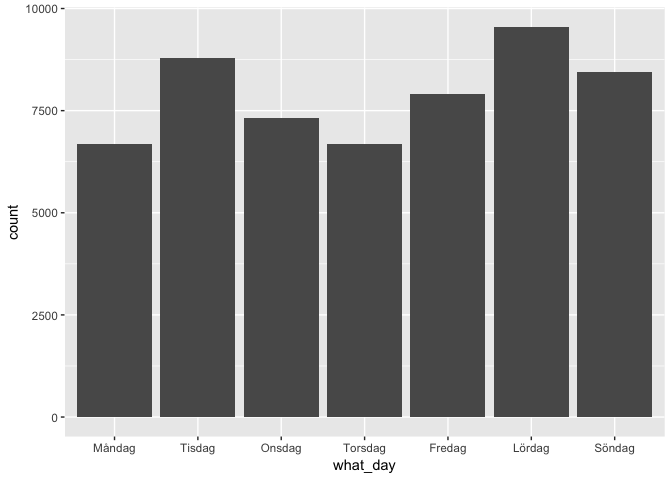
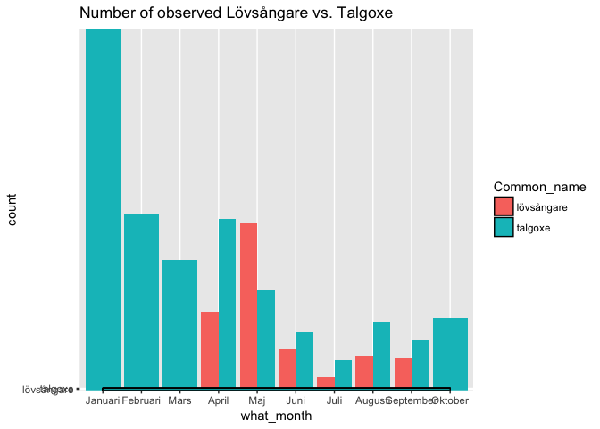
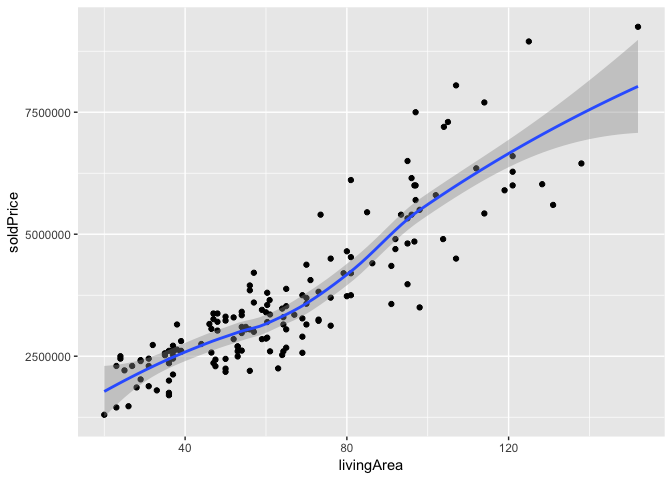
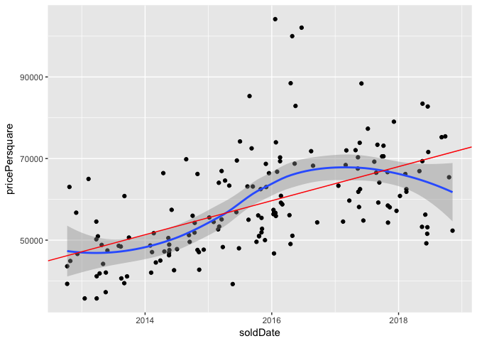
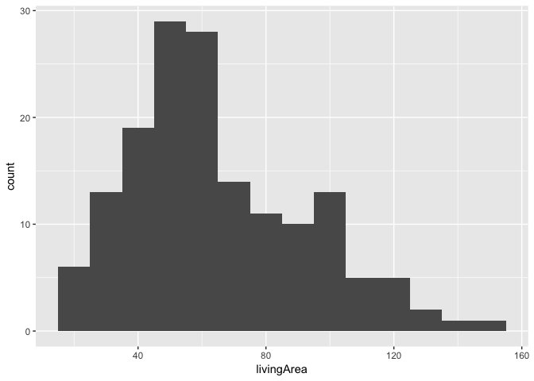
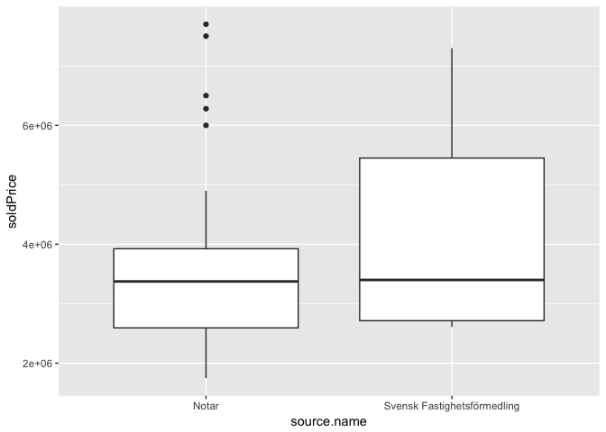

Homework 2
================

*Rahul Duggal*

*860118-4198*

*18 november 2018*

Birdwatching
============

Data
----

We take a look at the data structure:

``` r
glimpse(species_data)
```

    Observations: 55,374
    Variables: 16
    $ `Scientific name`            <chr> "Lepus europaeus", "Larus fuscus"...
    $ `Common name`                <chr> "fälthare", "silltrut", "silltrut...
    $ `Organism group`             <chr> "Däggdjur", "Fåglar", "Fåglar", "...
    $ `Occurrence status`          <chr> "Present", "Present", "Present", ...
    $ `Recorded by`                <chr> "Henry Gudmundson", "Pär Grönhage...
    $ Locality                     <chr> "Brännkyrka sn, Enskedefältet", "...
    $ County                       <chr> "Stockholm", "Stockholm", "Stockh...
    $ `Coordinate uncertainty (m)` <int> 10, 1962, 1962, 10, 70, 70, 70, 7...
    $ X                            <int> 2010152, 2004678, 2004678, 200669...
    $ Y                            <int> 8242684, 8243673, 8243673, 824922...
    $ Start                        <chr> "06/04/2018", "29/03/2018", "24/0...
    $ End                          <chr> "06/04/2018", "29/03/2018", "24/0...
    $ Dataset                      <chr> "Species Observations System (Art...
    $ `Uncertain determination`    <chr> "False", "False", "False", "False...
    $ Identification               <chr> "Unvalidated", "Unvalidated", "Un...
    $ ObservationId                <int> 113645773, 113482322, 115220647, ...

We need to change the format on several variables:

``` r
#============DATA TIDYING======================================================

#CHANGE SPACE TO UNDERSCORE-----------------------------------------------
names(species_data) <- gsub(" ", "_", names(species_data)) 
  #byter alla kolumn-namn med innehållande mellanslag till underlines istället

#Ändra format till as.Date ----------------------------------------------
species_data <- species_data %>%
  mutate( Start = as.Date(Start, "%d/%m/%Y")) 
  #Ändra format till DATE på 'Start'-kolumnen

species_data <- species_data %>%
  mutate( End = as.Date(End, "%d/%m/%Y")) 
  #Ändra format till DATE på 'End'-kolumnen

#Ändra format till BOOL -------------------------------------------------
species_data <- species_data %>%
  mutate( Uncertain_determination = as.logical(Uncertain_determination) )
  #Ändra format till BOOL (logical=TRUE/FALSE) på 'Uncertain_determination'-kolumnen

#Create variable Date (that simply is equal to Start) ----------------------
species_data <- species_data %>%
  mutate(Date=Start)
#=============================================================================
```

We are now ready to do the tasks.

Bird watching - task 1
----------------------

**List the most recorded bird species (Organism\_group == "Fåglar") in January and in July (two tables with Common\_name and number observed as columns). The function knitr::kable is useful for rendering tables in Markdown.**

We sort out data for january and july and then sort out the most common birds observerd during these months.

``` r
#==========TASK 1=========================================================================
# List the most recorded bird species (Organism_group == "Fåglar") in January and in July 
# (two tables with Common_name and number observed as columns). The function knitr::kable 
# is useful for rendering tables in Markdown.

birds_jan_jul <- species_data %>% 
  mutate(what_month=months(Date)) %>% #Translate dates to months
  filter(Organism_group == "Fåglar", what_month == c("Januari", "Juli")) %>% #Filter out what we need
  select(Common_name, what_month) #pick out only name and months

levels(as.factor(birds_jan_jul$what_month)) #==>[1] "Januari" "Juli" #Double checking
```

    [1] "Januari" "Juli"   

``` r
NrBirds_Jan_Jul=as.data.frame(table(birds_jan_jul)) 
#'table' summarizes the number-of-birdname-observations in Common_name with resp. to month

NrBirds_Jan <- NrBirds_Jan_Jul %>%
  filter(what_month == "Januari") %>% #We only take out january-birds
  arrange(desc(Freq)) %>%             #We arrange according to Freq
  select(Common_name, Freq) %>%       #Take away column what_month
  head(10)                            #Choose top 10 

NrBirds_Jul <- NrBirds_Jan_Jul %>%
  filter(what_month == "Juli") %>%    #We only take out july-birds
  arrange(desc(Freq)) %>%             #We arrange according to Freq
  select(Common_name, Freq) %>%       #Take away column what_month
  head(10)                            #Choose top 10 


Result=as.data.frame(c(NrBirds_Jan, NrBirds_Jul))
colnames(Result) <- c("January Top 10 birds", "Count", "July Top 10 birds", "Count") 
#Result

knitr::kable(Result, row.names = T)
```

|     | January Top 10 birds |  Count| July Top 10 birds |  Count|
|-----|:---------------------|------:|:------------------|------:|
| 1   | koltrast             |    239| tornseglare       |     42|
| 2   | blåmes               |    174| silltrut          |     40|
| 3   | talgoxe              |    171| koltrast          |     39|
| 4   | skata                |    151| ringduva          |     34|
| 5   | björktrast           |    149| sothöna           |     29|
| 6   | gräsand              |    124| steglits          |     29|
| 7   | mindre korsnäbb      |    119| fiskmås           |     22|
| 8   | gråsparv             |    115| gräsand           |     20|
| 9   | kråka                |    114| stare             |     19|
| 10  | gråtrut              |    108| blåmes            |     18|

``` r
#===================================================================================
```

Bird watching - task 2
----------------------

**Introduce a variable Weekday by applying the function weekdays to Date. Visualise the weekly activity of observers by a bar graph showing the number of bird sightings each day of the week. Make sure the bars are ordered from Monday to Sunday (see textbook 15.4).**

Since R use alphabetic ordering of factors we need to over-write the factorization with correct order of the weekdays. We then create a barplot of how many birds are observed accumulated on a weekday over the period Jan-Oct 2018.

``` r
#=========================TASK 2====================================================

#change dates to weekdays #transform it to factors
species_data_weekdays= species_data %>%
  mutate(what_day=as.factor(weekdays(Date))) 

day_levels=c("Måndag", 
               "Tisdag", 
               "Onsdag", 
               "Torsdag", 
               "Fredag", 
               "Lördag", 
               "Söndag")

species_data_weekdays$what_day <- factor(species_data_weekdays$what_day, levels = day_levels)
#change levels in 'what_day'-column
levels(species_data_weekdays$what_day) #double check
```

    [1] "Måndag"  "Tisdag"  "Onsdag"  "Torsdag" "Fredag"  "Lördag"  "Söndag" 

``` r
#plot the counts-birds-seen on each weekday accumulated over the whole period (jan-oct)
ggplot(species_data_weekdays, aes(x=what_day)) +
  geom_bar() 
```



Bird watching - task 3
----------------------

**The Willow warbler (lövsångare, Phylloscopus trochilus) is one of the most common migratory birds in Sweden, spending winters in sub-Saharan Africa. List the first five (unique) observers (Recorded\_by) recording a Willow warbler in Stockholm, together with the date recorded.**

We will first filter out dataset for Lövsångare, order the dates and then pick out the 5 first observers observed on those dates.

``` r
#=====================TASK 3================================================

lovsangare <- species_data %>%
  filter(Common_name == "lövsångare") %>%
  arrange(Date) %>%
  select(Recorded_by, Date) %>%
  head(5)

lovsangare=as.data.frame(lovsangare)

knitr::kable(lovsangare, row.names = T)
```

|     | Recorded\_by             | Date       |
|-----|:-------------------------|:-----------|
| 1   | Maud Tyboni, Jon Sjöberg | 2018-04-15 |
| 2   | Hans Norelius            | 2018-04-17 |
| 3   | Ola Sångberg             | 2018-04-19 |
| 4   | Hans Norelius            | 2018-04-20 |
| 5   | Magnus Glennstål         | 2018-04-20 |

Bird watching - task 4
----------------------

**Plot the monthly number of recorded lövsångare and talgoxe (Common\_name %in% c("lövsångare", "talgoxe")) in the same figure.**

We firstly need to order the factorization of the months correctly. Then we pick out data set for lövsångare and talgoxe so that we can plot a simultaneous barplot for both birds.

``` r
#=====================TASK 4================================================

birds <- species_data %>% 
  mutate(what_month=months(Date)) %>%
  filter(Common_name %in% c("lövsångare", "talgoxe"))

month_levels=c("Januari",    
               "Februari", 
               "Mars", 
               "April", 
               "Maj", 
               "Juni", 
               "Juli",
               "Augusti",
               "September",
               "Oktober",
               "November",
               "December")

birds$what_month <- factor(birds$what_month, levels = month_levels) 
  # <--- Change levels of months so that they appear in order

#DOUBLE CHECKING:
levels(as.factor(birds$Common_name)) #double check #==> [1] "lövsångare" "talgoxe"  
```

    [1] "lövsångare" "talgoxe"   

``` r
levels(as.factor(birds$what_month))  #double check #==> [1] "Januari"   "Februari" --osv-->
```

     [1] "Januari"   "Februari"  "Mars"      "April"     "Maj"      
     [6] "Juni"      "Juli"      "Augusti"   "September" "Oktober"  
    [11] "November"  "December" 

``` r
#PLOTTING COUNT - Talgoxe vs. Lövsångare:
ggplot(birds, aes(x=what_month, fill=Common_name)) +
  geom_bar(position="dodge") +
  ggtitle("Number of observed Lövsångare vs. Talgoxe") +
  geom_density(aes(x=what_month, y=Common_name))
```



We can easily see that Lövsångare are gone during winther season.

Apartment prices
================

Data
----

We first take a look at the data:

``` r
glimpse(booli)
```

    Observations: 158
    Variables: 27
    $ listPrice                        <int> 3995000, 1995000, 5100000, 54...
    $ rent                             <int> 4467, 1773, 3839, 4483, 1696,...
    $ livingArea                       <dbl> 73.0, 36.0, 81.0, 107.0, 29.0...
    $ rooms                            <dbl> 3.0, 1.0, 3.0, 4.0, 1.0, 4.0,...
    $ published                        <dttm> 2018-10-15 13:33:18, 2018-10...
    $ constructionYear                 <int> 1935, 1968, 1936, 1936, 1936,...
    $ objectType                       <chr> "Lägenhet", "Lägenhet", "Läge...
    $ booliId                          <int> 3263989, 3256231, 3236660, 32...
    $ soldDate                         <date> 2018-11-08, 2018-10-19, 2018...
    $ soldPrice                        <int> 3820000, 2355000, 6110000, 80...
    $ soldPriceSource                  <chr> "bid", "maklare", "bid", "bid...
    $ url                              <chr> "https://www.booli.se/annons/...
    $ floor                            <int> NA, 1, 3, 3, 3, 4, 1, 1, 0, 2...
    $ additionalArea                   <int> NA, 0, 0, 0, NA, 0, NA, 0, 0,...
    $ apartmentNumber                  <chr> NA, "1103", "1301", NA, NA, N...
    $ plotArea                         <int> NA, NA, NA, NA, NA, NA, NA, N...
    $ location.address.streetAddress   <chr> "Åminnevägen 19", "Docentback...
    $ location.position.latitude       <dbl> 59.37103, 59.37124, 59.37162,...
    $ location.position.longitude      <dbl> 18.05406, 18.05782, 18.05472,...
    $ location.position.isApproximate  <lgl> NA, NA, NA, NA, TRUE, NA, TRU...
    $ location.region.municipalityName <chr> "Stockholm", "Stockholm", "St...
    $ location.region.countyName       <chr> "Stockholms län", "Stockholms...
    $ location.distance.ocean          <int> 260, 218, 186, 218, 166, 218,...
    $ source.name                      <chr> "MOHV", "Notar", "Historiska ...
    $ source.id                        <int> 1901865, 1566, 65645750, 1566...
    $ source.type                      <chr> "Broker", "Broker", "Broker",...
    $ source.url                       <chr> "http://www.mohv.se/", "http:...

We will change format, if necessary or needed, during the tasks.

Apartment prices - task 1
-------------------------

**Illustrate how Soldprice depends on Livingarea with a suitable figure.**

We illustrate this with points and a smooth curve.

``` r
# =================(1)=====================
ggplot(booli) + geom_point(aes(x=livingArea, y=soldPrice)) + geom_smooth(aes(x=livingArea, y=soldPrice)) 
```

    `geom_smooth()` using method = 'loess'

    Warning: Removed 1 rows containing non-finite values (stat_smooth).

    Warning: Removed 1 rows containing missing values (geom_point).



``` r
#We observe two extreme values that are >  8750000 threshold

#Pick out row number of extreme values:
extremerow=which(booli$soldPrice > 8750000) #row nr = [6 60]

booli$soldPrice[extremerow] #==> [1] 8950000 9250000
```

    [1] 8950000 9250000

We can see in the plot that there are 2 observations that are very high in sold price, above 8750000 SEK. We find out that the that those sold prices are 8,950,000 and 9,250,000 SEK. Pretty expensive for less that 140*m*<sup>2</sup> living area.

Apartment prices - task 2
-------------------------

**Illustrate trends in Soldprice / Livingarea over the period.**

We illustrate the trends with a scatter plot, smooth line and a regression fitted line.

``` r
# =================(2)=====================

#CREATE sq/price-column
booli = booli %>%
  mutate(pricePersquare=round(soldPrice/as.integer(livingArea)))

#double check 6 first elements
head(booli$pricePersquare) 
```

    [1] 52329 65417 75432 75234 82759 71600

``` r
#---------regression-line-------------
regression=lm(booli$pricePersquare ~ as.Date(booli$soldDate))
int=regression$coefficients[1]
slo=regression$coefficients[2]
#-------------------------------------  

#plot sq/price with 2 types of fitting line:
ggplot(booli) + geom_point(aes(x=soldDate, y=pricePersquare)) +geom_smooth(aes(x=soldDate, y=pricePersquare)) +
    geom_abline(intercept = int, slope = slo, col="red")
```

    `geom_smooth()` using method = 'loess'

    Warning: Removed 1 rows containing non-finite values (stat_smooth).

    Warning: Removed 1 rows containing missing values (geom_point).



Apartment prices - task 3
-------------------------

**Illustrate an aspect of data using a table.**

``` r
# =================(3)=====================

#Separate adress and adress number 
booli2=separate(booli, location.address.streetAddress, c("Adress", "Nr"))

#Make adress into factors
booli2$Adress <- as.factor(booli2$Adress)
  #booli2$Adress #==> 4 Levels: Docentbacken Ekhagsvägen Torphagsvägen Åminnevägen

#Make constructionYear into factors
booli2$constructionYear = as.factor(booli2$constructionYear)
  #booli2$constructionYear #==> Levels: 1931 1934 1935 1936 1937 1939 1968 1969

#Create table of how  many appartments where built under each year for each adress.
adress_year=table(booli2$Adress,booli2$constructionYear)
adress_year=as.data.frame(adress_year)
adress_year=spread(adress_year, Var2,Freq)

knitr::kable(adress_year, row.names = T)
```

|     | Var1          |  1931|  1934|  1935|  1936|  1937|  1939|  1968|  1969|
|-----|:--------------|-----:|-----:|-----:|-----:|-----:|-----:|-----:|-----:|
| 1   | Docentbacken  |     0|     0|     0|     0|     0|     0|    19|    11|
| 2   | Ekhagsvägen   |     2|     2|    35|     1|     3|     8|     0|     0|
| 3   | Torphagsvägen |     0|     0|    42|    11|     0|     0|     0|     0|
| 4   | Åminnevägen   |     0|     0|     3|     5|     2|     0|     0|     0|

Apartment prices - task 4
-------------------------

**Illustrate an aspect of data using a histogram.**

We illustrate frequencies of the sizes of the liviing areas.

``` r
# =================(4)=====================
#Histogram over living area
ggplot(booli,aes(x=livingArea)) + 
  geom_histogram(binwidth = 10)
```

    Warning: Removed 1 rows containing non-finite values (stat_bin).



Seems that there are mostly of 40*m*<sup>2</sup> − 70*m*<sup>2</sup> apartments.

Apartment prices - task 5
-------------------------

**Illustrate an aspect of data using a boxplot (geom\_boxplot).**

We illustrate boxplots for two different real estate agencies - Notar and Svensk Fastighetsförmedling.

``` r
# =================(5)=====================

realestate=table(as.factor(booli$source.name))
realestate=as.data.frame(realestate)
colnames(realestate)=c("Agency", "Count")

Notar <- booli2 %>%
  filter(source.name == c("Notar", "Svensk Fastighetsförmedling"  ))

ggplot(Notar, aes(x = source.name, y = soldPrice)) + geom_boxplot() 
```



Svensk Fastighetsförmedling tends to sell for higher prices. However, according to the data, Notar is selling more quantities of apartments so we can not draw any conclusions just based on this.

THE END
=======
